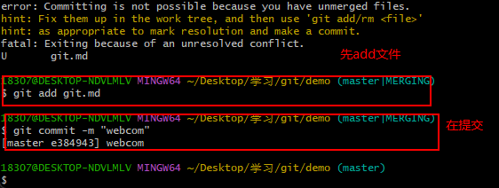
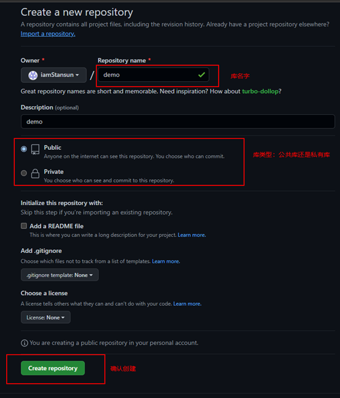
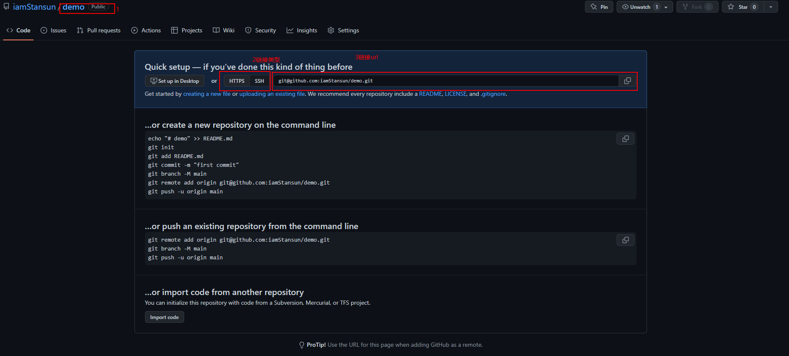
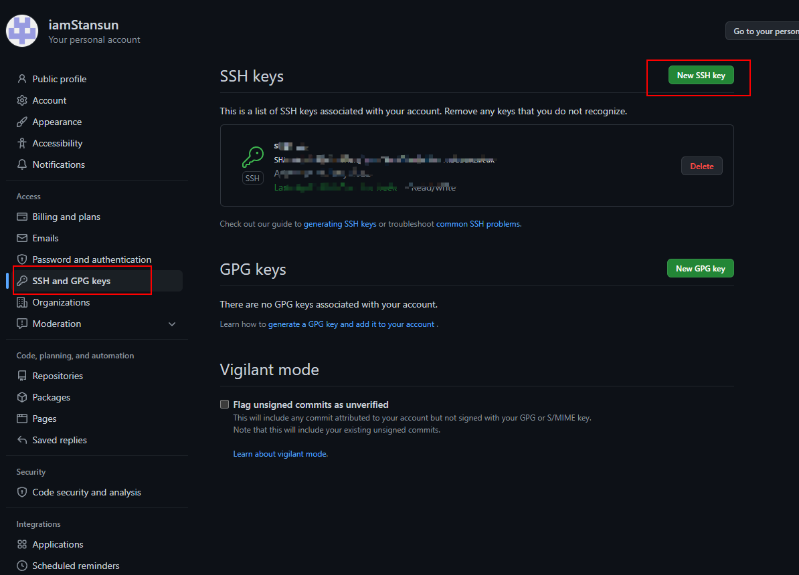

```
<!-- 命令名称 作用 -->
git config --global user.name 用户名 设置用户签名
git config --global user.email 邮箱 设置用户签名
git init 初始化本地库
git status 查看本地库状态
git add 文件名 添加到暂存区
git commit -m "日志信息" 文件名 提交到本地库
git reflog 查看历史记录
git log 查看详细历史记录
git reset --hard 版本号 版本穿梭

```


```
<!-- 命令名称 作用 -->
git branch 分支名 创建分支
git branch -v 查看分支
git checkout 分支名 切换分支
git merge 分支名 把指定的分支合并到当前分支上
```
### 合并分支冲突



## github
操作步骤

1、 登录网址
``` html
https://github.com/
```
2、新建库

3、引用链接

```js 
https://github.com/iamStansun/demo.git

// 查看别名
$ git remote -v
// 创建别名
$ git remote  add demo https://github.com/iamStansun/demo.git

```


### ssh 登录

用户文件夹下面创建 ssh 加密

```
ssh-keygen -t rsa -C   用户名
<!-- 然后三个回车确认 -->

```


```js
// 创建ssh完毕之后
//  创建别名
git remote  add demossh git@github.com:iamStansun/demo.git

// 推送文件
git push demossh master

// 拉取文件
git pull demossh master

```

测试vscode

测试 web vscode
